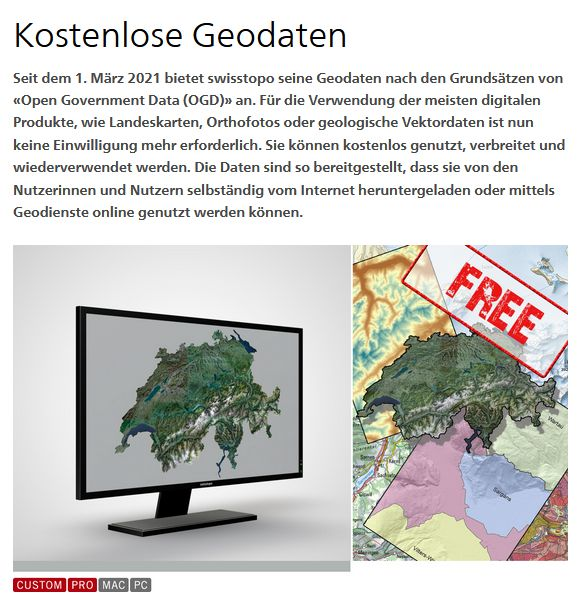
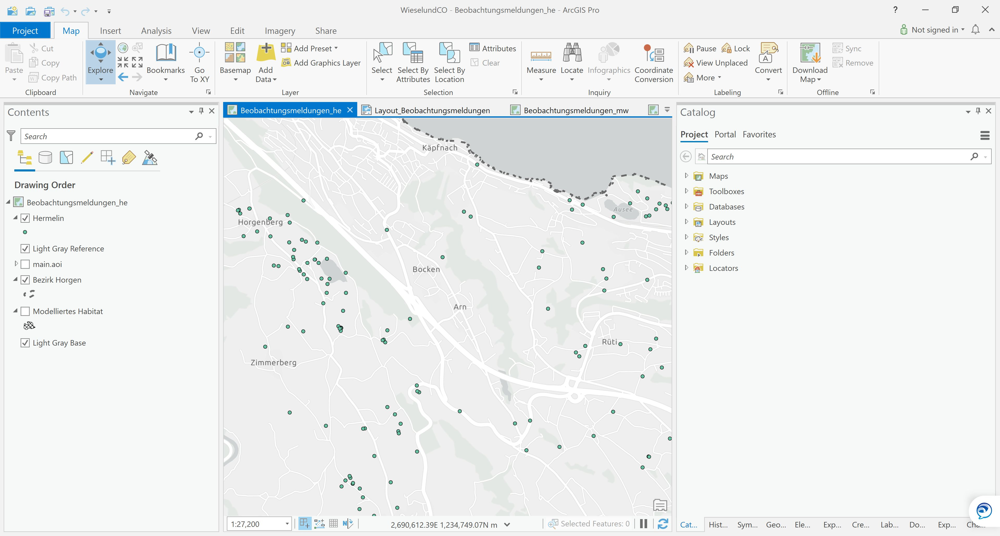
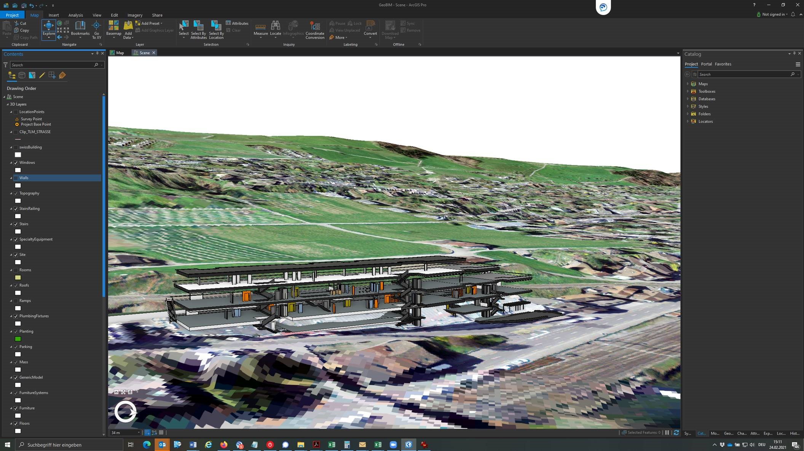
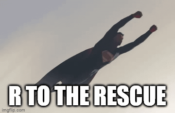
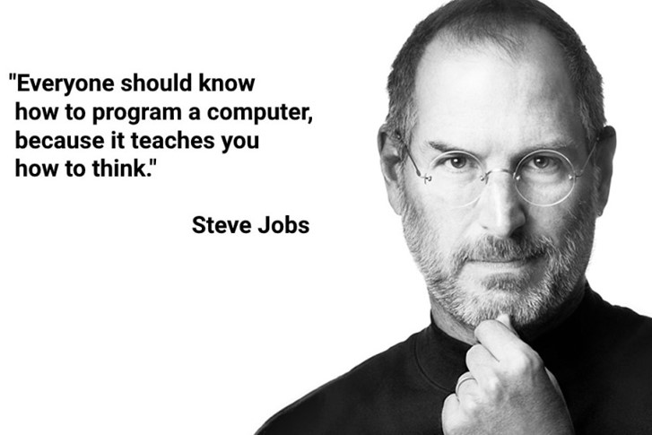
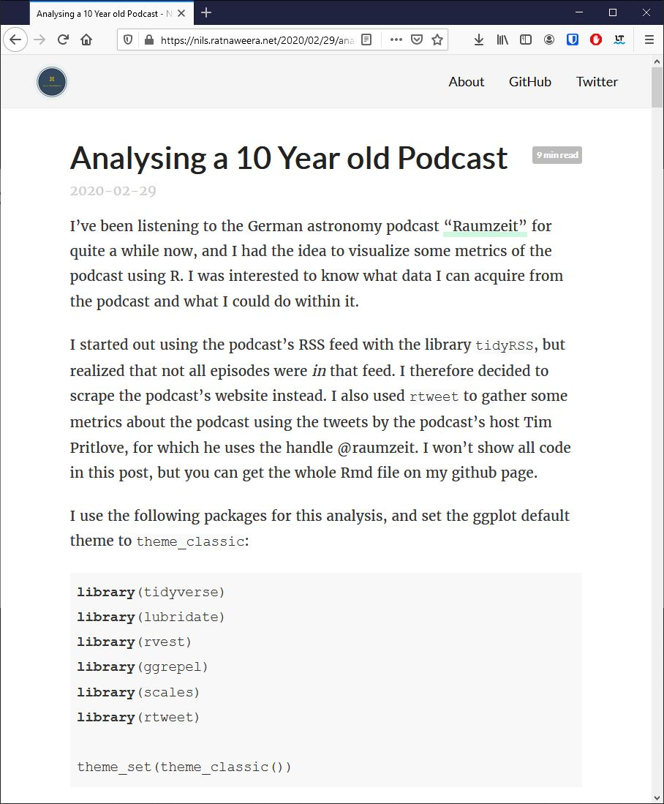
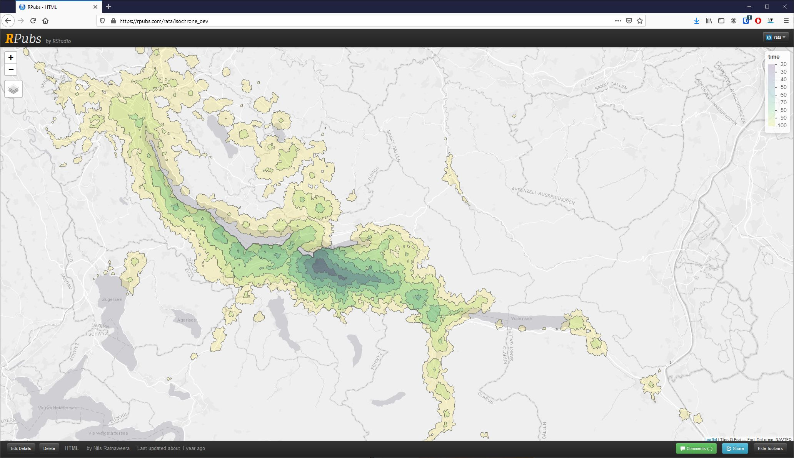
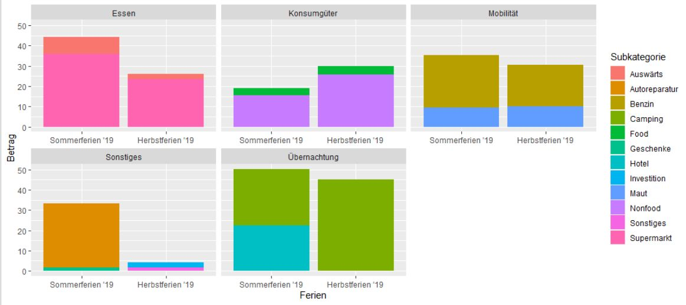
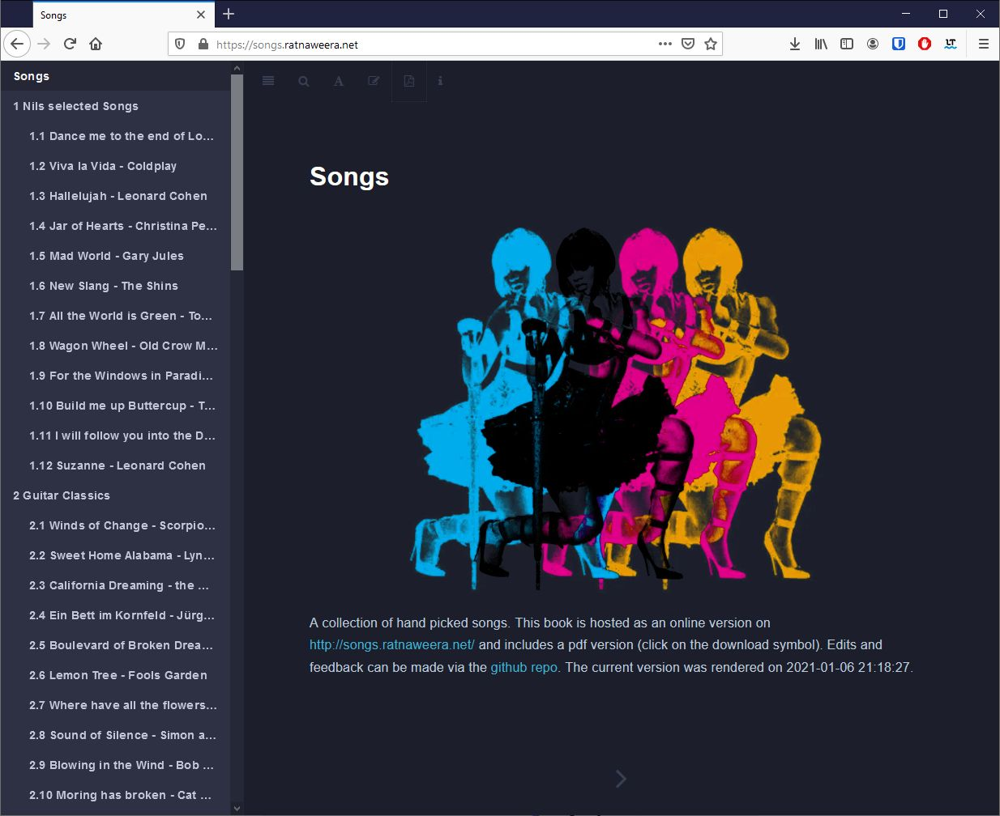

class: inverse, middle


```{r, echo = FALSE}
library(fontawesome)
xaringanExtra::use_panelset()
xaringanExtra::use_fit_screen()
xaringanExtra::use_share_again()
```

# Ablauf

### `r fa("map-marked")` Teil 1: Ausgangslage

### `r fa("gift")` Teil 2: Das Produkt 

### `r fa("laptop-code")` Teil 3: Demo 

### `r fa("binoculars")` Teil 4: Ausblick & Lessons learnt  


???

Zeitplan für heute, jeder Block ca. 10min

---


class: inverse

## Wer wir sind

<div style = "display: table;">

<p style = "float:right"> Nils Ratnaweera </p>
</div>
<div style = "display: table;">

<p style = "float:right">Nikolaos Bakogiannis </p>
</div>
<div style = "display: table;">

<p style = "float:right">Patrick Laube</p>

</div>

???

Forschungsgruppe Geoinformatik
---

layout: true
class: inverse

# Ausgangslage

---

--

.footnote[Franklin, Carl and Hane, Paula “An introduction to GIS: linking maps to databases” Database. 15 (2) April, 1992, 17-22.]


- 80% aller Daten haben eine räumliche Komponente (Franklin & Hane, 1992)

--

- dies gilt *insbesondere* für den Bereich der Life Sciences

--

- ein sicherer Umgang mit räumlichen Daten ist deshalb eine zentrale Fähigkeit für viele Abgänger des Dept. N

--


???

Seit Montag sind alle Geodaten des Bundes öffentlich


---
```{r, echo = FALSE, out.width="65%", fig.cap = ""}

```

---

```{r, echo = FALSE, out.width="80%", fig.cap = ""}

```

???

So erhalten Studierende zahlreiche Kurse rund um das ThemA GIS und Geodaten, vor allem, aber nicht nur UIs

---
```{r, echo = FALSE, out.width="80%", fig.cap = "Screenshot aus einem Projekt in Zusammenarbeit mit dem FM"}

```


---


- GUI-Software bieten einen einfachen Einstieg in den Umgang mit Geodaten

--

- Am Dep. wird deshalb hauptsächlich ArcGIS unterrichtet

--

- Aber: ArcGIS...

--
  
  - ... ist nicht skalierbar (Stichwort HPC)

--
  
  - ... ist kaum reproduzierbar

--

  - ... ist proprietär
  
--

  - ... ist kostenpflichtig

---

layout: false
class: inverse


```{r, echo = FALSE, fig.align="center", out.width="60%"}

```


---

layout: true
class: inverse

# Die Programmiersprache `R`

---

--

... hat sich in den letzten Jahren zu einem vollumfänglichen GIS entwickelt

--

... nutzen Studierende und Mitarbeiter bereits für statistische Analysen

--

... ist skalierbar (läuft auf unserem HPC)
  
--

  
... ermöglicht reproduzierbare Resultate

--

... ist Open Source 
  
--

... ist kostenlos

--

**Vor allem**: R macht spass!


---
layout: false
class: inverse, middle, center

```{r, echo = FALSE, out.width="80%", fig.align='center'}

```

???

Das Beherrschen einer Programmiersprache wird im Zeitalter der Digitalisierung immer wichtiger


---

layout: true
class: inverse

# `R` kann sehr vielseitig eingesetzt werden

---

Blogs schreiben ([nils.ratnaweera.net](https://nils.ratnaweera.net/))

```{r, echo = FALSE, out.width="80%", fig.align='center', fig.cap="nils.ratnaweera.net"}

```

---

Wohnungen suchen (Quelle: [rpubs.com/rata](https://rpubs.com/rata/isochrone_oev))

```{r, echo = FALSE, out.width="80%", fig.align='center'}

```

Isochronen für ÖV Erreichbarkeit 
---

Ferienausgaben analysieren

```{r, echo = FALSE, out.width="80%", fig.align='center'}

```


---


Bücher schreiben (Quelle: [songs.ratnaweera.net](https://songs.ratnaweera.net/))

```{r, echo = FALSE, out.width="80%", fig.align='center'}

```


---

oder eben Geodaten analysieren und visualisieren (Quelle: [nils.ratnaweera.net](https://nils.ratnaweera.net/2020/06/06/using-rayshader-to-visualize-lake-zurich/))


???

Warnen, dass hier ein GIF läuft


---

layout: false
class: inverse, middle

Einige wollen von ArcGIS zu `R` wechseln...


<blockquote class="twitter-tweet"><p lang="en" dir="ltr">Y’all ArcMap is making me soo angry! Thinking of transitioning to do GIS solely in R. Any helpful hints out there? <a href="https://twitter.com/hashtag/rstats?src=hash&amp;ref_src=twsrc%5Etfw">#rstats</a> <a href="https://twitter.com/hashtag/rspatial?src=hash&amp;ref_src=twsrc%5Etfw">#rspatial</a> <a href="https://twitter.com/hashtag/GIS?src=hash&amp;ref_src=twsrc%5Etfw">#GIS</a> <a href="https://twitter.com/hashtag/ArcGIS?src=hash&amp;ref_src=twsrc%5Etfw">#ArcGIS</a> <a href="https://twitter.com/hashtag/phdchat?src=hash&amp;ref_src=twsrc%5Etfw">#phdchat</a> <a href="https://twitter.com/hashtag/ecology?src=hash&amp;ref_src=twsrc%5Etfw">#ecology</a> <a href="https://twitter.com/hashtag/LandscapeEcology?src=hash&amp;ref_src=twsrc%5Etfw">#LandscapeEcology</a></p>&mdash; Kim Serno (@KimSerno) <a href="https://twitter.com/KimSerno/status/1191809034044743680?ref_src=twsrc%5Etfw">November 5, 2019</a></blockquote> <script async src="https://platform.twitter.com/widgets.js" charset="utf-8"></script> 

???

das Lernen von Programmiersprachen ist zwar schwierig, aber machbar. Und da kommt unser Projekt ins Spiel

---
class: inverse, middle

<blockquote class="twitter-tweet"><p lang="en" dir="ltr">Goodbye <a href="https://twitter.com/hashtag/arcgis?src=hash&amp;ref_src=twsrc%5Etfw">#arcgis</a> you&#39;ve replaced by <a href="https://twitter.com/hashtag/rstats?src=hash&amp;ref_src=twsrc%5Etfw">#rstats</a> forever. A milestone worth celebrating!!! <a href="https://t.co/FJ85eOIMPS">pic.twitter.com/FJ85eOIMPS</a></p>&mdash; Nicole T.M. Hill (@NicoleTMHill) <a href="https://twitter.com/NicoleTMHill/status/1218735367467044864?ref_src=twsrc%5Etfw">January 19, 2020</a></blockquote> <script async src="https://platform.twitter.com/widgets.js" charset="utf-8"></script> 

---

class: inverse, middle


## Ende des ersten Blockes... Fragen?

