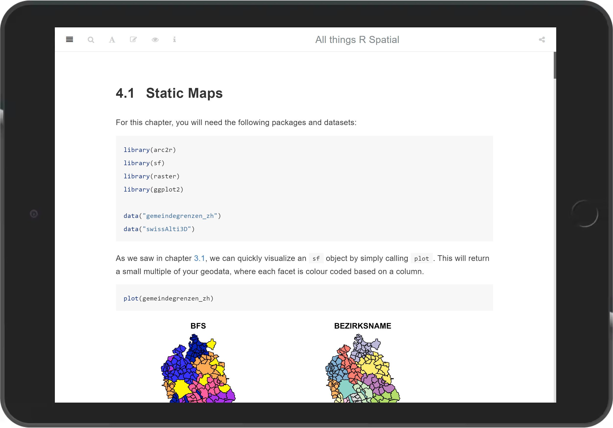
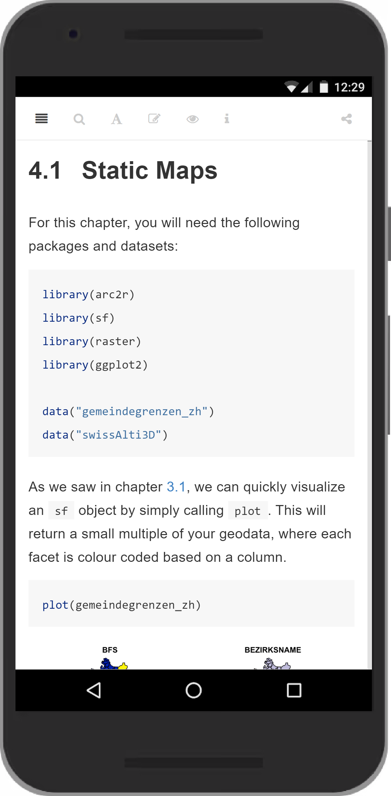
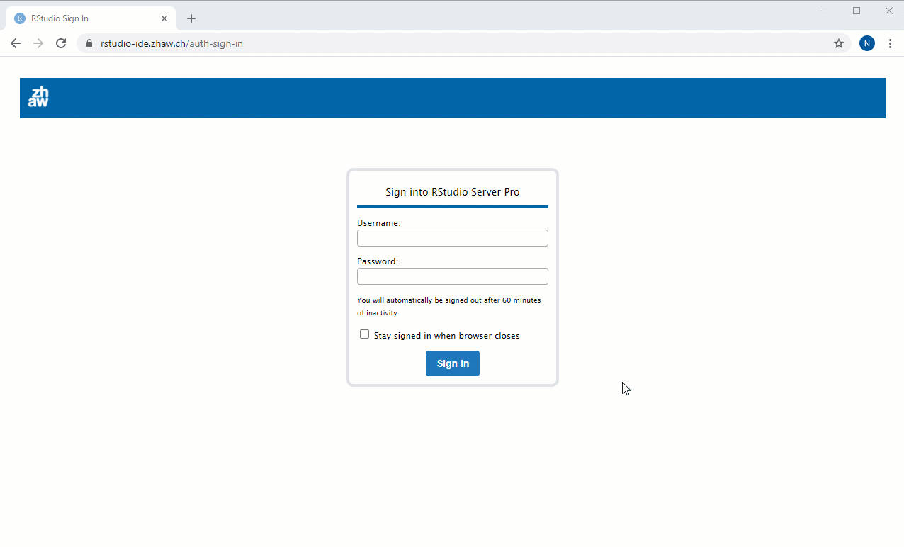
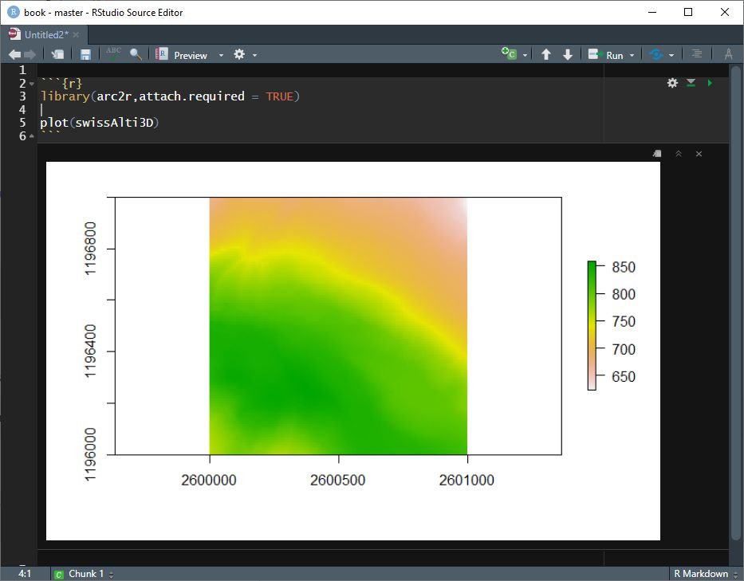
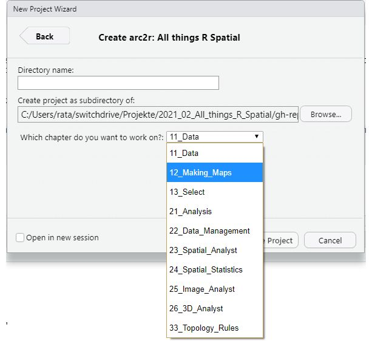

layout: false
class: inverse


```{r, echo = FALSE}
library(fontawesome)
xaringanExtra::use_panelset()
```


# Was haben wir entwickelt?


--

Eine *Lernumgebung*, um den Wechsel ArcGIS →  `R` zu erleichtern

--

Aufgeteilt in zwei Komponenten (Arbeitspakete `r fa("box-open")`):

--

## .center[`r fa("box-open")` Webbasiertes Lehrmittel]

--

## .center[`r fa("box-open")` Virtual Lab im Browser]
--


---
class: inverse, middle, center


## `r fa("box-open")` Webbasiertes Lehrmittel

--

[`r fa("link")` arc2r.github.com/book](https://arc2r.github.io/book/)


---
name: detail-lehrmittel
class: inverse 


# `r fa("box-open")` Im Detail 

.left-column[

Webbasiertes Lehrmittel

]

---

template: detail-lehrmittel

.right-column[

### Webbasiert bedeutet *responsive*  






]


???

Die Unterlagen lassen sich sehr elegant auf externen Geräten wie Tables oder smartphones darstellen. Praktisch damit der Computer bildschirm nicht überladen ist (BYOD!)

---
template: detail-lehrmittel

.right-column[

### Webbasiert bedeutet *interaktiv *  


<iframe style="position: absolute; height: 50%; border: none" src="https://arc2r.github.io/book/" name="book", width = "65%">Alternativtext</iframe>


]


???

- Menu auf/zu klappen
- Suchfenster

---
template: detail-lehrmittel

.right-column[

### Webbasiert bedeutet *anpassbar*  


<iframe style="position: absolute; height: 50%; border: none" src="https://arc2r.github.io/book/" name="book", width = "65%">Alternativtext</iframe>


]


???

- Schriftgrösse / -stil
- Hintergrundfarbe

---
template: detail-lehrmittel

.right-column[

### Webbasiert bedeutet *kommentierbar*  


<iframe style="position: absolute; height: 50%; border: none" src="https://arc2r.github.io/book/" name="book", width = "65%">Alternativtext</iframe>


]


???

- Kommentar erstellen

---
class: inverse, middle, center


## `r fa("box-open")` Virtual Lab im Browser

[rstudio-ide.zhaw.ch](https://rstudio-ide.zhaw.ch/)

---
name: detail-virtuallab
class: inverse 

# `r fa("box-open")` Im Detail 

.left-column[

Virtual Lab im Browser


]


---
template: detail-virtuallab

.right-column[

### Besteht aus:

- RStudio im Browser
- RPackage
]

???

RStudio ist eine bestehende ZHAW Infrastruktur, die wir im Rahmen der Lehre ins Leben gerufen haben und vom ICT der ZHAW getragen wird. Wurde *nicht* im Rahmen dieses Projektes entwickelt


---

template: detail-virtuallab

.right-column[

### RStudio im Browser

verkürzt die Distanz *lesen → selbst ausführen*





]

???
- Keine Installation von R / RStudio notwendig
- ist Betriebssystem unabhängig
- schneller Einstieg mit ZHAW login


---
template: detail-virtuallab

.right-column[

### R Package `r fa("tools")`

- verkürzt die Distanz *lesen → selbst ausführen*
- Auslieferung von 
  - Geodaten
  - Metadaten
  - Libraries
  - R-Code


]

???


---

template: detail-virtuallab

.right-column[

### R Package `r fa("tools")`

Einfache Auslieferung von *Geodaten* 

```{r, echo = FALSE, out.width="90%"}

```

]

???

- es müssen keine R Geodaten runtergeladen weren

---
template: detail-virtuallab

.right-column[

### R Package `r fa("tools")`

Einfache Auslieferung von *Metadaten* 

[`r fa("link")` arc2r.github.com/arc2r](https://arc2r.github.io/arc2r/)


]

???

- Wenn man ein R-Package entwickelt und dabei github nutzt, ist eine solche website fast schon "gratis" mit dabei

---

template: detail-virtuallab

.right-column[

### R Package `r fa("tools")`

Einfache Auslieferung von *Libraries* 

```{r, eval = FALSE}
install.packages("remotes")
library(remotes)

# installiert alle benötigten Libraries:
install_github("arc2r/arc2r", dependencies = TRUE)
```
]

???

- die notwendigen libraries werden automatisch installiert

---
template: detail-virtuallab

.right-column[

### R Package `r fa("tools")`

Einfache Auslieferung von *R Code* 

```{r, echo = FALSE}

```
]

???

- kurz demonstrieren?

---
