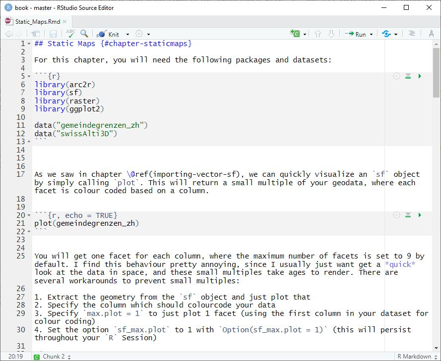
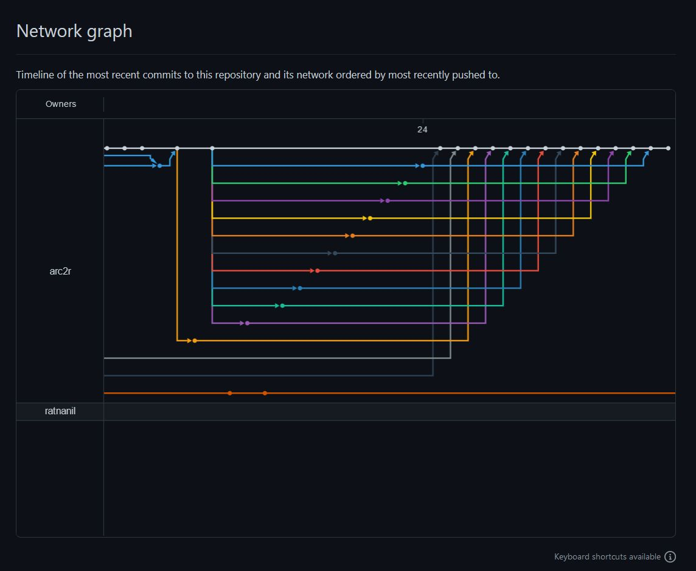
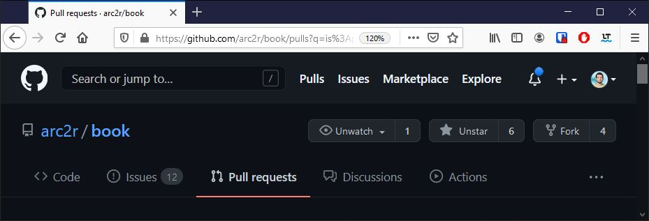

class: middle, center

# Block 2: Was haben wir entwickelt?

```{r, echo = FALSE}
library(fontawesome)
xaringanExtra::use_panelset()
```


---
layout: false
class: inverse

# Was haben wir entwickelt?


--

Eine *Lernumgebung*, um den Wechsel `R` → ArcGIS zu erleichtern

--

Aufgeteilt in zwei Komponenten (Arbeitspakete `r fa("box-open")`):

--

## .center[`r fa("box-open")` Webbasiertes Lehrmittel]

--

## .center[`r fa("box-open")` Virtual Lab im Browser]
--

  - ZHAW-RStudio (rstudio.zhaw.ch)
--
  
  - R Package
  


---
name: detail-lehrmittel
class: inverse 


# `r fa("box-open")` Im Detail 

.left-column[

Webbasiertes Lehrmittel

]

---
template: detail-lehrmittel


.right-column[

### RMarkdown  `r fa("markdown")` 

- Text und R-Code existieren im *gleichen* Dokument
- Kein Copy & Paste von Code bzw. dessen Outputs 

]


???

Outputs wie zum Beispiel Grafiken, Messages, Karten

---
layout: false
class: inverse

.panelset[
.panel[.panel-name[RMarkdown]

```{r, echo = FALSE}


```
]

.panel[.panel-name[Output]

```{r, echo = FALSE}
knitr::include_graphics("rmarkdown-example-output.jpg")

```
]
]

---
template: detail-lehrmittel

.right-column[

### Source Code auf Github  `r fa("github-square")` 

- ermöglicht ein *hohes Grad* an Kollaboration 

```{r, echo = FALSE}


```


]


---

template: detail-lehrmittel

.right-column[

### Source Code auf Github  `r fa("github-square")` 

- Ressource soll durch die Community weiterentwickelt werden (*Pull requests*)

```{r, echo = FALSE}
knitr::include_graphics("gh-pullrequests-dark.jpg")

```


]


---

template: detail-lehrmittel

.right-column[

### Source Code auf Github  `r fa("github-square")` 

- erhöht die Sichtbarkeit

```{r, echo = FALSE}


```


]

???

  github ist das "Facebook" von Opensource projekten und offenen lehrmitteln
  

---
template: detail-lehrmittel

.right-column[

### Webbasiert bedeutet *responsive*  


]


???

Die Unterlagen lassen sich sehr elegant auf externen Geräten wie Tables oder smartphones darstellen. Praktisch damit der Computer bildschirm nicht überladen ist (BYOD!)

---
template: detail-lehrmittel

.right-column[

### Webbasiert bedeutet *interaktiv *  


<iframe style="position: absolute; height: 50%; border: none" src="https://arc2r.github.io/book/" name="book", width = "65%">Alternativtext</iframe>


]


???

- Menu auf/zu klappen
- Suchfenster

---
template: detail-lehrmittel

.right-column[

### Webbasiert bedeutet *anpassbar*  


<iframe style="position: absolute; height: 50%; border: none" src="https://arc2r.github.io/book/" name="book", width = "65%">Alternativtext</iframe>


]


???

- Schriftgrösse / -stil
- Hintergrundfarbe

---
template: detail-lehrmittel

.right-column[

### Webbasiert bedeutet *kommentierbar*  


<iframe style="position: absolute; height: 50%; border: none" src="https://arc2r.github.io/book/" name="book", width = "65%">Alternativtext</iframe>


]


???

- Kommentar erstellen

---
name: detail-virtuallab
class: inverse 

# `r fa("box-open")` Im Detail 

.left-column[

Virtual Lab im Browser

]


---

template: detail-virtuallab

.right-column[

### RStudio im Browser  `r fa("internet-explorer")` 

verkürzt die Distanz *lesen → selbst ausführen*


- bestehende Infrastruktur (ICT ZHAW) 
- Keine Installation von R / RStudio notwendig
- ist Betriebssystem unabhängig
- schneller Einstieg mit ZHAW login


]


---
template: detail-virtuallab

.right-column[

### R Package  `r fa("tools")` 

- verkürzt die Distanz *lesen → selbst ausführen*
- Auslieferung von: 

.panelset[
.panel[.panel-name[Geodaten]

```{r, echo = FALSE}
knitr::include_graphics("geodata.jpg")

```
]

.panel[.panel-name[Libraries]

```{r, echo = FALSE}
knitr::include_graphics("rmarkdown-example-output.jpg")

```
]

.panel[.panel-name[Code]

```{r, echo = FALSE}
knitr::include_graphics("rmarkdown-example-output.jpg")

```
]

]

]

???

- es müssen keine R Geodaten runtergeladen weren
- die notwendigen libraries werden automatisch installiert
- der R-Code zum selbst ausprobieren wird als Template zur Verfügung gestellt

---


