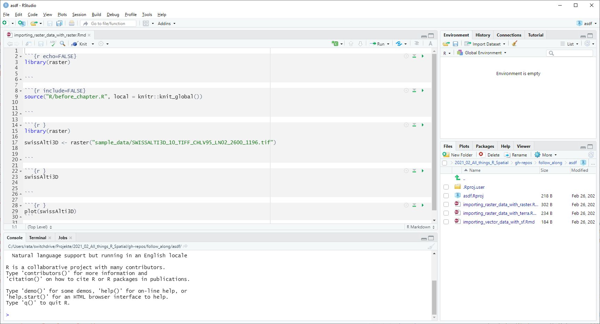

layout: true
class: inverse

## Erste Schritte

---
class: middle

- Mit ein bisschen Erfahrung in R ist die Handhabung von Geodaten kinderleicht

- Schauen wir uns mal die Lernumgebung an, die wir entwickelt haben

- dazu besuchen wir [arc2r.github.io/book](https://arc2r.github.io/book/)

???

- Handling vom buch zeigen: TOC ein aus, Suchfunktion, Schriftgrösse und Art
- Warum englisch? um die Internationale R und GIS Community involvieren zu können 

---
layout: false

<iframe style="position: absolute; height: 90%; border: none" src="https://arc2r.github.io/book/" name="book", width = "80%">Alternativtext</iframe>


---

layout: true
class: inverse

## Grundsätzliche Unterschiede zwischen ArcGIS und `R`


---

Grundbaustein in ArcMap ist die *Map*. 

???

Sie beansprucht am meisten Platz im Interface  


```{r, echo = FALSE}
knitr::include_graphics("geobim.jpg")
```

---

Grundbaustein in `R` ist das *Script*

???

Es beansprucht am meisten Platz im Interface  


```{r, echo = FALSE}

```

---


Mit ArcGIS hat man grundsätzlich *eine* Ansprechsperson (ESRI). Auf CRAN werden zurzeit >17'000 Packages angeboten, von fast so vielen Entwicklern.

<!-- es gibt immer N+1 wege ein Problem in R zu lösen -->
--


Während ESRI für viele Funktionen eigene Namen entwickelt hat, werden in `R` die branchenüblichen Standards verwendet. <!-- Beispiel Clip, Select,  -->  

--

ArcGIS Versucht grundätzlich, ein Tool für jedes Problem zu entwickeln. In den meisten `R` Packages versucht man ein minimales Set an Funktionen anzubieten, die auf die eignen bedürfnissen angepasst werden kann. 


<!-- Bild einfügen vom Netzwerkdiagramm -->

---


layout: true
class: inverse

## Wo brilliert ArcGIS gegenüber `R`?


---

- Georeferenzieren

```{r, echo = FALSE}
knitr::include_graphics("https://i.ytimg.com/vi/o2bq8yE0XWE/maxresdefault.jpg")
```


---

- Karten digitalisieren


```{r, echo = FALSE}
knitr::include_graphics("https://desktop.arcgis.com/de/arcmap/10.3/manage-data/creating-new-features/GUID-D6396C58-0375-402D-B3C2-441E76A18AED-web.png")
```


<!-- Quck and dirty map? -->


