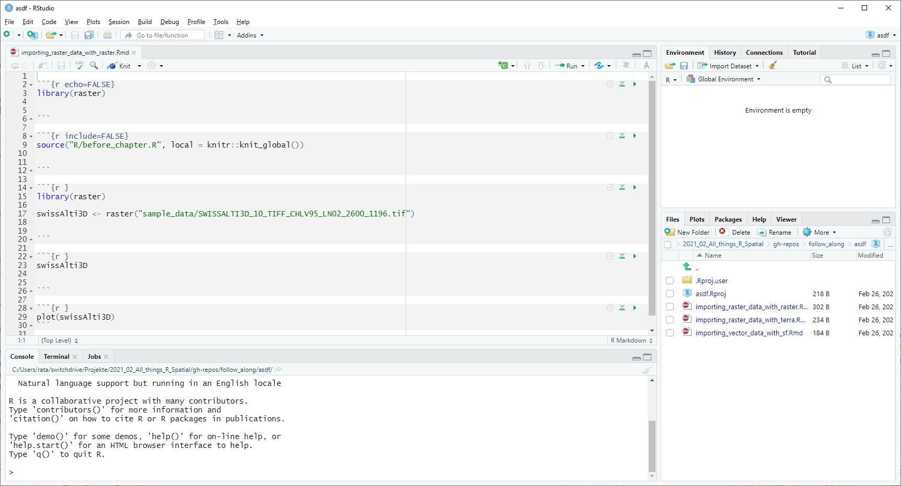

class: inverse

```{r, echo = FALSE}
library(fontawesome)
xaringanExtra::use_panelset()
```

## Was haben wir gelernt?

- Konzeptionelle Unterschiede zwischen ArcGIS und `R`
- Eine Reihe wichtiger Tools
  - `R-Markdown` / `bookdown`
  - Schreiben von R-Packages (`pkgdown`)
  - Kollaboration über Github
  - Verwendung von Github-Actions


---
layout: true
class: inverse

## Konzeptionelle Unterschiede ArcGIS ↔ `R`


---

.pull-left[


Grundbaustein in ArcMap ist die *Map*. 
```{r, echo = FALSE}
knitr::include_graphics("gis_wieselundco.jpg")
```

]

.pull-right[


Grundbaustein in `R` ist das *Script*

```{r, echo = FALSE}

```

]


???

Sie beansprucht am meisten Platz im Interface  
Das macht ArcGIS leichter zugänglich


---


.pull-left[


*Eine* Ansprechsperson (ESRI)
]

.pull-right[


\> 17'000 Packages von fast ebenso vielen Entwicklern.
]


???
es gibt immer N+1 wege ein Problem in R zu lösen 

---

.pull-left[


Verwendet oftmals Eigennamen  <!-- Beispiel Clip, Select,  -->  
]

.pull-right[


Verwendet branchenübliche Standards
]


---

.pull-left[


Für jedes Problem ein Tool

[`r fa("link")` arc2r.github.com/book](https://arc2r.github.io/book/20_Geoprocessing_Tools.html)


]

.pull-right[


*Minimales Set* an Tools die auf die eigenen Bedürfnissen angepasst werden können 
]

---

layout: true
class: inverse

## Wo brilliert ArcGIS gegenüber `R`?


---


.pull-left[
- Georeferenzieren

```{r, echo = FALSE}
knitr::include_graphics("https://i.ytimg.com/vi/o2bq8yE0XWE/maxresdefault.jpg")
```


]

.pull-right[
- Karten digitalisieren


```{r, echo = FALSE}
knitr::include_graphics("https://desktop.arcgis.com/de/arcmap/10.3/manage-data/creating-new-features/GUID-D6396C58-0375-402D-B3C2-441E76A18AED-web.png")
```

]

---
layout: false
class: invert

## Verwendung von R-Markdown, `bookdown`


- Text und R-Code existieren im *gleichen* Dokument
- Kein Copy & Paste von Code bzw. dessen Outputs 


.panelset[
.panel[.panel-name[RMarkdown]

```{r, echo = FALSE}
knitr::include_graphics("rmarkdown-example.jpg")

```
]

.panel[.panel-name[Output]

```{r, echo = FALSE}


```
]
]

???

Outputs wie zum Beispiel Grafiken, Messages, Karten

---
layout: false
class: inverse


---
class: inverse 


## Webbasiert ist die Zukunft!

---
class: inverse 
layout: true


### Source Code auf Github  `r fa("github-square")` 


---

- ermöglicht ein *hohes Grad* an Kollaboration 

```{r, echo = FALSE}
knitr::include_graphics("Git-Network-dark.jpg")

```

---

- Ressource soll durch die Community weiterentwickelt werden (*Pull requests*)

```{r, echo = FALSE}


```

---

- erhöht die Sichtbarkeit

```{r, echo = FALSE}
knitr::include_graphics("gh-stars-dark.jpg")

```


???

github ist das "Facebook" von Opensource projekten und offenen lehrmitteln
  


