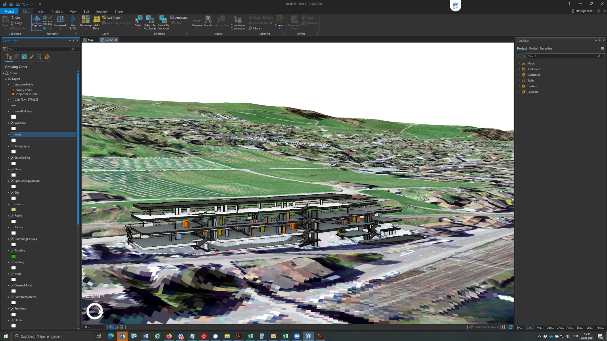

## Grundsätzliche Unterschiede zwischen ArcGIS und `R`


---

Grundbaustein in ArcMap ist die *Map*. 


```{r, echo = FALSE}

```


???

Sie beansprucht am meisten Platz im Interface  


---

Grundbaustein in `R` ist das *Script*


```{r, echo = FALSE}
knitr::include_graphics("rstudio.jpg")
```

???

Es beansprucht am meisten Platz im Interface  


---
title: "All Things `R` spatial: Räumliche Daten in `R`"
subtitle: "Teil 3: Erste Schritte"
author: "Nils Ratnaweera (ZHAW)"
date: "`r Sys.Date()`"
output:
  xaringan::moon_reader:
    css: [default, default-fonts, mystyle.css]
    lib_dir: libs
    nature:
      highlightStyle: github
      highlightLines: true
      countIncrementalSlides: false
    includes:
      after_body: insert-logo.html
---

---


Mit ArcGIS hat man grundsätzlich *eine* Ansprechsperson (ESRI). Auf CRAN werden zurzeit >17'000 Packages angeboten, von fast so vielen Entwicklern.

<!-- es gibt immer N+1 wege ein Problem in R zu lösen -->
--


Während ESRI für viele Funktionen eigene Namen entwickelt hat, werden in `R` die branchenüblichen Standards verwendet. <!-- Beispiel Clip, Select,  -->  

--

ArcGIS Versucht grundätzlich, ein Tool für jedes Problem zu entwickeln. In den meisten `R` Packages versucht man ein minimales Set an Funktionen anzubieten, die auf die eignen bedürfnissen angepasst werden kann. 


<!-- Bild einfügen vom Netzwerkdiagramm -->

---


layout: true
class: inverse

## Wo brilliert ArcGIS gegenüber `R`?


---

- Georeferenzieren

```{r, echo = FALSE}
knitr::include_graphics("https://i.ytimg.com/vi/o2bq8yE0XWE/maxresdefault.jpg")
```


---

- Karten digitalisieren


```{r, echo = FALSE}
knitr::include_graphics("https://desktop.arcgis.com/de/arcmap/10.3/manage-data/creating-new-features/GUID-D6396C58-0375-402D-B3C2-441E76A18AED-web.png")
```


<!-- Quck and dirty map? -->


