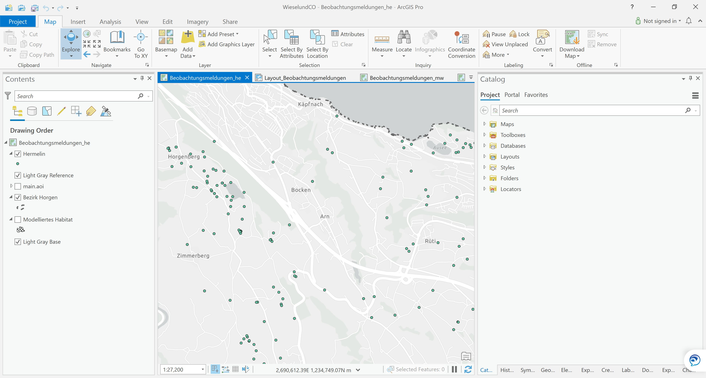

class: inverse

```{r, echo = FALSE}
library(fontawesome)
xaringanExtra::use_panelset()
```

## Was haben wir gelernt?

- Konzeptionelle Unterschiede zwischen ArcGIS und `R`

--

- Wichtige Tools für Forschung und Lehre

--

  - `R-Markdown` / `bookdown`

--

  - Schreiben von R-Packages (`pkgdown`)

--

  - Git, Github und Github Actions


---
class: inverse, middle, center

## Konzeptionelle Unterschiede ArcGIS ↔ `R`


---
layout: true
class: inverse

## Konzeptionelle Unterschiede ArcGIS ↔ `R`


---

.pull-left[


Grundbaustein ist die *Map*. 
```{r, echo = FALSE}

```

]

.pull-right[


Grundbaustein ist das *Script*

```{r, echo = FALSE}
knitr::include_graphics("rstudio.jpg")
```

]


???

Sie beansprucht am meisten Platz im Interface  
Das macht ArcGIS leichter zugänglich


---


.pull-left[


*Einen* Ansprechspartner (ESRI)
]

.pull-right[


\> 17'000 Packages von fast ebenso vielen Entwicklern.
]


???
es gibt immer N+1 wege ein Problem in R zu lösen 

---

.pull-left[


Verwendet oftmals Eigennamen  <!-- Beispiel Clip, Select,  -->  
]

.pull-right[


Verwendet branchenübliche Standards
]


---

.pull-left[


Für jedes Problem ein Tool

[`r fa("link")` arc2r.github.io/book](https://arc2r.github.io/book/20_Geoprocessing_Tools.html)


]

.pull-right[


*Minimales Set* an Tools die auf die eigenen Bedürfnisse angepasst werden können 

]

---

layout: false
class: inverse

## Wo brilliert ArcGIS gegenüber `R`?

--

.pull-left[
- Georeferenzieren

```{r, echo = FALSE}
knitr::include_graphics("https://i.ytimg.com/vi/o2bq8yE0XWE/maxresdefault.jpg")
```


]


--

.pull-right[
- Karten digitalisieren


```{r, echo = FALSE}
knitr::include_graphics("https://desktop.arcgis.com/de/arcmap/10.3/manage-data/creating-new-features/GUID-D6396C58-0375-402D-B3C2-441E76A18AED-web.png")
```

]

---

layout: false
class: inverse, middle, center

## Wichtige Tools für Forschung und Lehre

---


layout: false
class: inverse

## Verwendung von `R-Markdown`, `bookdown`


- Text und R-Code existieren im *gleichen* Dokument
- Kein Copy & Paste von Code bzw. dessen Outputs 


.panelset[
.panel[.panel-name[RMarkdown]

```{r, echo = FALSE}
knitr::include_graphics("rmarkdown-example.jpg")

```
]

.panel[.panel-name[Output]

```{r, echo = FALSE}
knitr::include_graphics("rmarkdown-example-output.jpg")

```
]
]

???

Outputs wie zum Beispiel Grafiken, Messages, Karten

---

layout: false
class: inverse


### Webbasiert ist die Zukunft!

<iframe width="560" height="315" src="https://www.youtube.com/embed/GCmnvXXrpRk?start=126" frameborder="0" allow="accelerometer; autoplay; clipboard-write; encrypted-media; gyroscope; picture-in-picture" allowfullscreen></iframe>

> *In HTML and the Web I trust*

> \- *Yihui Xie (2019)*


> 


---
class: inverse 
layout: true

### Source Code auf Github  `r fa("github-square")` 


---

- ermöglicht ein *hohes Grad* an Kollaboration 

```{r, echo = FALSE}
knitr::include_graphics("Git-Network-dark.jpg")

```

---

- Ressource kann (und wird) durch die Community weiterentwickelt

```{r, echo = FALSE}
knitr::include_graphics("gh-pullrequests-dark.jpg")

```

???

Stichwort *Pull requests*
Demonstration machen
 
 
---

- erhöht die Sichtbarkeit

```{r, echo = FALSE}
knitr::include_graphics("gh-stars-dark.jpg")

```


???

github ist das "Facebook" von Opensource projekten und offenen lehrmitteln

---

#### Verwendung von Github Actions

- vordefinierte "Rezepte" die bei bestimmten Ereignissen ausgeführt werden

--

  - z.B. wird das Buch bei Änderungen neu Kompiliert

--

- erlaubt das Testen von Code auf verschiedenen Plattformen (MacOS, Linux, Windows)

--

- Qualitätssicherung und Automatisierung


  

---

layout: false
class: inverse

# `r fa("binoculars")` Ausbilck 

Wie geht es weiter?

--

- Einsatz von `arc2r` in Lehre (Bachelor und Master)

--

- Fortlaufende Ergänzung des Lehrmittels nach Bedarf

--

- Involvierung

--

  - Mitarbeitenden

--

  - Studierenden

--

  - Extern

--

- Folgeprojekt *DataChallenge@N*

--

  - Projektantrag eingereicht (1. März 2021)
  
--

  - mit DataChallenge und Hackday Data Skills spielerisch vermitteln

---


class: inverse, middle


## Vielen Dank an das Departament N und die AG Studium für die Bewilligung diesses Projekts!

