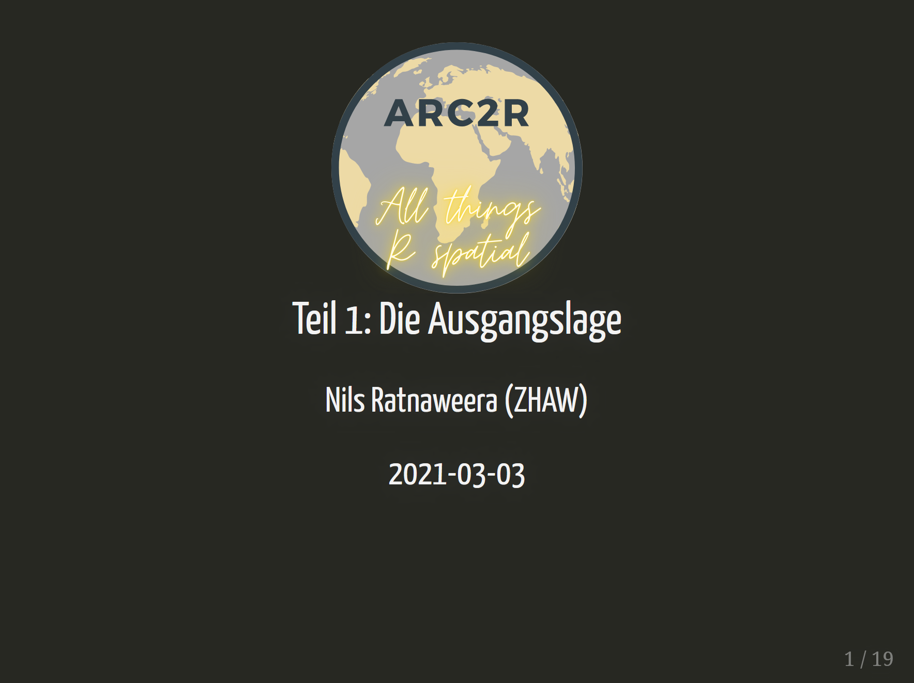
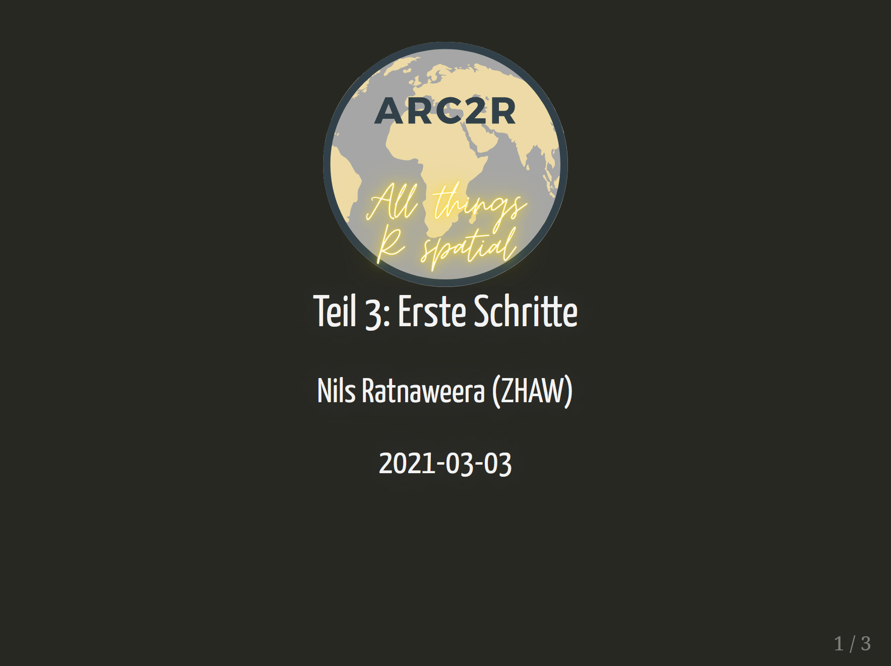
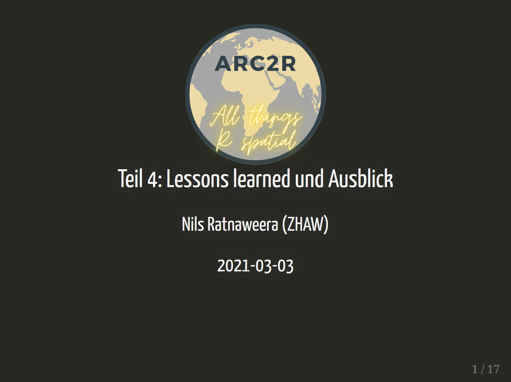

Klicke auf das Bild um die entsprechenden Slides zu sehen!

Warum wir dieses Projekt lanciert haben

Was haben wir entwickelt?

Erste Schritte mit arc2r

Ein Schritt zurück: Vorstellung der Tools und lessons learned 

